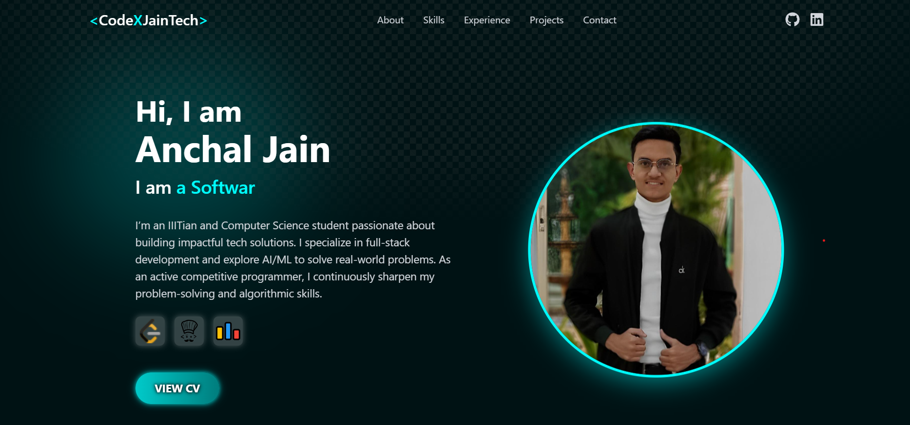
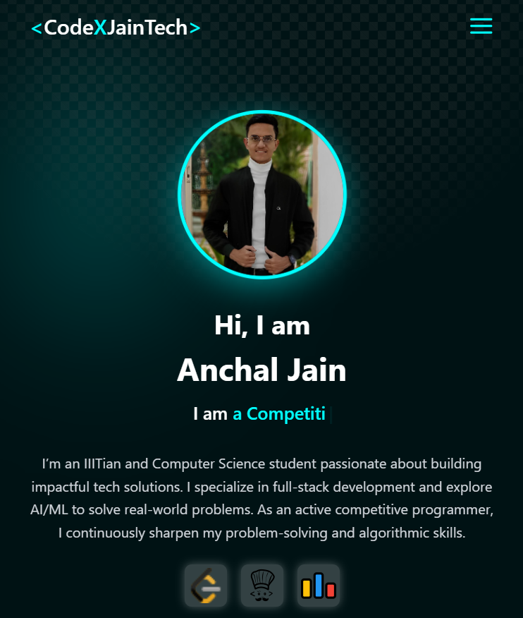
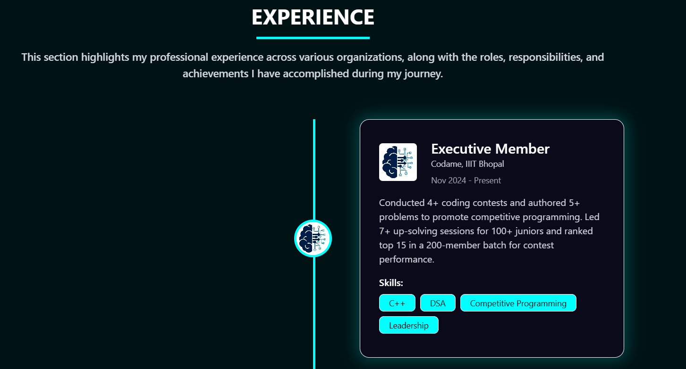
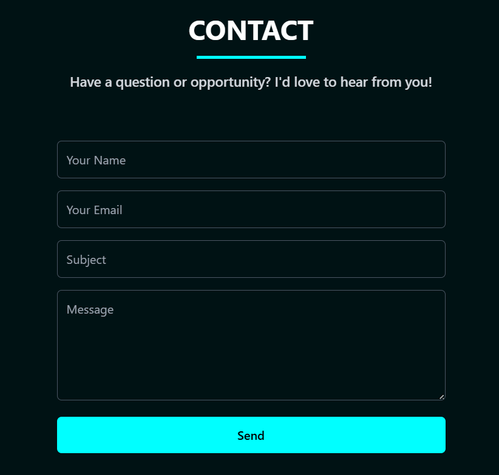

<p align="center">
  
  
  
  
</p>

# 📖 About the Project
This is my personal portfolio website, designed to showcase my skills, projects, and experience in a clean and visually appealing way. It is built with **React + Vite** for blazing-fast performance and **Tailwind CSS** for modern styling.

---

## 🚀 Features
- Fully responsive modern UI.  
- Sections for **Skills, Projects, Experience, and Contact**.  
- Integrated **EmailJS** for contact form submissions.  
- **Fast build and HMR** powered by Vite.  

---

## 🛠 Tech Stack
- **Frontend:** React, Tailwind CSS  
- **Bundler:** Vite  
- **Icons:** React Icons  
- **Deployment:** GitHub Pages / Vercel / Netlify  

---

## ⚡ Getting Started
Clone this repository and run it locally:

```bash
# Clone repo
git clone https://github.com/CodeXJainTech/portfolio.git

# Go to project folder
cd portfolio

# Install dependencies
npm install

# Run development server
npm run dev
```

## 🌐 Live Demo
[**View Portfolio**](https://your-portfolio-link.com)
# Portfolio
